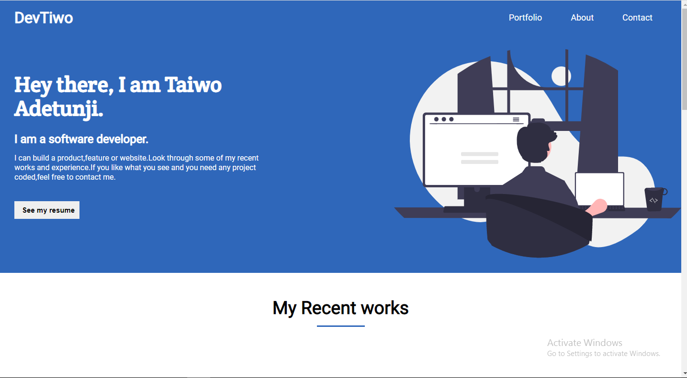
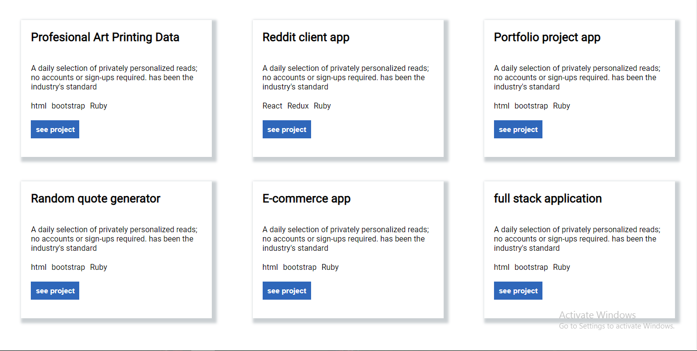
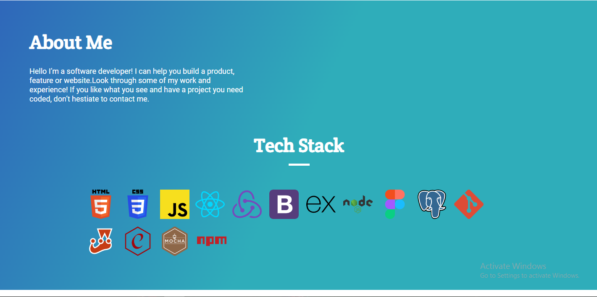
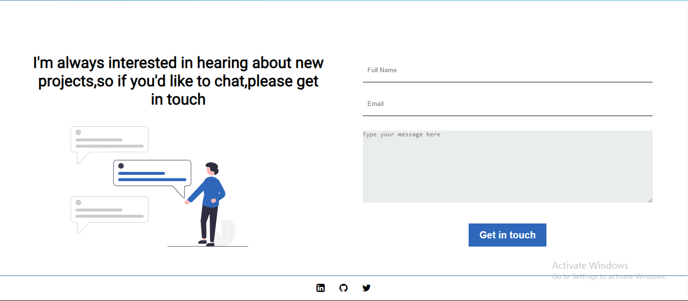

# Portfolio

> This project is a personal portfolio website to showcase all other projects i will be building.

## Built With

- HTML
- CSS
- JAVASCRIPT

## Live Demo
[Live Demo Link](https://devtiwo.netlify.app/)

## Getting Started
- clone the repository by running\
    `git clone https://github.com/Devtiwo/Portfolio.git`

- navigate to the folder\
    `cd Portfolio`

## Authors

👤 Taiwo Adetunji

- [GitHub](https://github.com/Devtiwo)
- [Twitter](https://twitter.com/devtiwo)
- [LinkedIn](https://www.linkedin.com/in/taiwo-adetunji-860666225/)

## 🤝 Contributing

Contributions, issues, and feature requests are welcome!

Feel free to check the [issues page](../../issues/).

## Show your support

Give a ⭐️ if you like this project!

## 📝 License

This project is MIT licensed.
